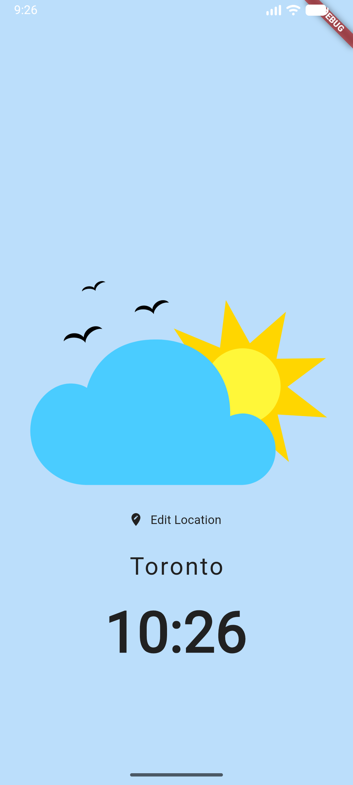
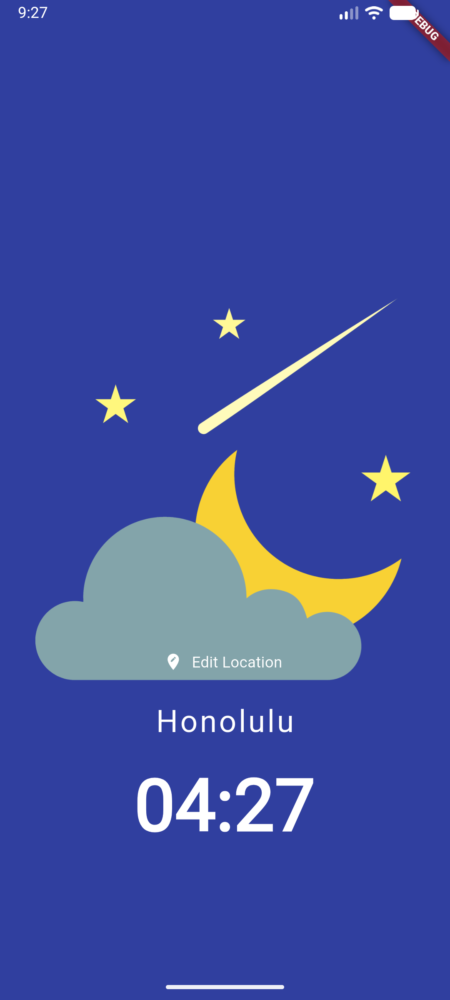
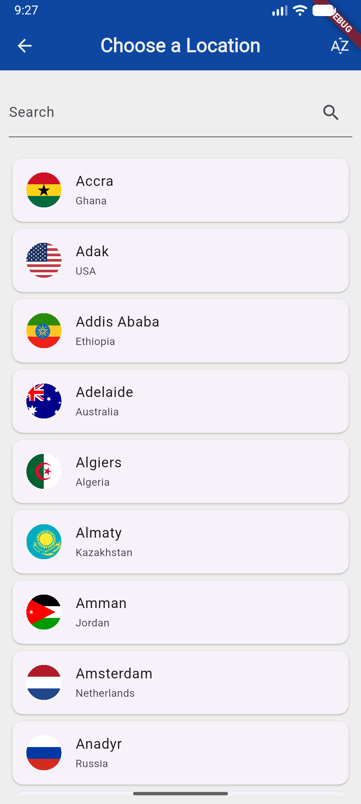
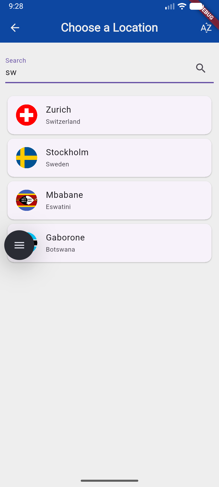

# World Time

An app to see time in the world.

## [⬇️ Click Here to Download ⬇️](https://github.com/get543/world_time/releases/latest/download/app-release.apk)

## Screenshots

| Day | Night |
| -- | -- |
|  |  |

| Choose Location | Search |
| -- | -- |
|  |  |

> [!NOTE]
> API : https://timeapi.io
>
> use this URL https://timeapi.io/api/Time/current/zone?timeZone=$url and just change `$url` to one of these [supported IANA timezones](https://timeapi.io/documentation/iana-timezones)

## Credit

<a href="https://www.flaticon.com/free-icons/earth-hour" title="earth-hour icons">Earth-hour icons created by bukeicon - Flaticon</a>

